# 👋 Hi, I'm Malish Shrestha

**Full-Stack Developer | UI/UX Enthusiast | Open Source Contributor**

### 🌐 Connect With Me

---

## 🎯 About Me

Passionate full-stack developer with expertise in building modern web applications. I enjoy solving complex problems, writing clean code, and creating engaging user experiences. Always learning and exploring new technologies.

---

## 💻 Tech Stack

### Frontend Development

### Backend & Database

### Build Tools & Package Managers

---

## 📊 GitHub Stats

 

---

## 🏆 Achievements

---

## 📈 Activity Metrics

---

**Feel free to reach out for collaboration or just a friendly chat!** 💬

