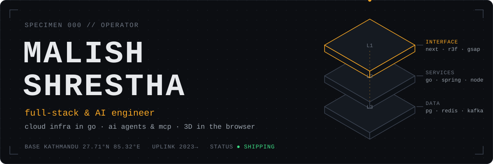

<a href="https://www.malishs.tech/"></a>

I build systems that have to stay correct under load, like two people booking the same parking spot at the same millisecond, and the interfaces on top of them, sometimes in 3D. I'm based in Kathmandu.

At **PixelVirt Technologies** I'm an Associate Software Engineer working on private-cloud infrastructure: Go services for OpenStack, Kubernetes and Ansible automation, plus VM migrations, with VMware next. Lately I've also been building MCP servers and AI agents ([kagent](https://kagent.dev)) on top of that stack.

&nbsp;

## Index · 005 specimens

### `005` [Crema](https://github.com/malish-stha/crema) — operating system for independent cafés
White-label and multi-tenant, built from 12 modules: QR ordering, a barista kitchen display, a 3D floor map, inventory, rostering, loyalty and cash reconciliation. My favourite part is a small loop. When a barista marks an ingredient out of stock on the kitchen display, every dish that uses it disappears from the customer's QR menu, so nobody has to remember to update it.
<br/><sub>`next 16` `react 19` `prisma` `nextauth` `three.js` `gsap` · [live →](https://crema-phi.vercel.app)</sub>

### `004` [Nuvio](https://github.com/malish-stha/nuvio) — desktop workspace for chat and voice
An Electron app (Nextron wrapping Next.js 16) with WebRTC voice and Pusher for presence. The API isn't bundled into the binary. It runs as serverless functions on Vercel, so backend changes ship without a new desktop build.
<br/><sub>`electron` `webrtc` `prisma` `neon postgres` `upstash redis` `clerk` · [live →](https://nuvio-wine.vercel.app)</sub>

### `003` [AltFinder](https://github.com/malish-stha/altFinder) — open-source alternatives to paid software
Spring Boot 3.3 on Java 21 behind a Next.js 16 front end. Gemini 2.5 Flash drafts the comparison tables and reviews. GitHub stars and activity are fetched live, not stored as snapshots that go stale. Clerk tokens are verified against JWKS inside Spring Security, with rate limiting in front.
<br/><sub>`spring boot` `java 21` `next 16` `redux toolkit` `supabase` `gemini` `docker` · [live →](https://alt-finder-zeta.vercel.app)</sub>

### `002` [Parkly](https://github.com/malish-stha/parkly) — event-driven parking reservations
You pick a spot on a map and hold it. Behind the map, a gateway, a parking service and a payment service talk over Kafka. When two people tap the same spot at once, a pessimistic write lock on the row means exactly one of them gets it. Unpaid holds expire after 15 minutes: a scheduler sweeps every 10 seconds and publishes the release back to Kafka.
<br/><sub>`spring boot` `kafka` `eureka` `postgres` `redis` `next.js` `leaflet` `three.js` · [live →](https://parkly-nu.vercel.app)</sub>

### `001` [Atmos clone](https://github.com/malish-stha/atmosClone) — a flight you control by scrolling
A plane follows a Catmull-Rom spline through a procedural sky, and your scroll position drives the camera. Built with React Three Fiber, Lamina shaders and post-processing. It's adapted from Wawa Sensei's tutorial, and the plane model is by Ab.316 (CC-BY-4.0).
<br/><sub>`react three fiber` `three.js` `lamina` `vite` · [live →](https://atmos-clone-bice.vercel.app)</sub>

<sub>Also on the bench: [vocalith](https://github.com/malish-stha/vocalith) (AI text-to-speech), [fitness-app](https://github.com/malish-stha/fitness-app) (Spring Cloud with Keycloak), [stock-crypto](https://github.com/malish-stha/stock-crypto) (Go backend), [dream-shop](https://github.com/malish-stha/dream-shop).</sub>

&nbsp;

## Chassis

```text
interface   next.js · react · three.js / r3f · gsap · tailwind · redux
services    go · spring boot · python / fastapi · node · electron · trpc
data        postgres · mongodb · redis · mysql · kafka · rabbitmq · prisma
ai          mcp servers · ai agents · kagent · gemini
infra       kubernetes · openstack · ansible · kubevirt · helm · docker · vercel
```

&nbsp;

## Live telemetry

<p align="center">
  
  
</p>

<p align="center">
  
</p>

<p align="center">
  
</p>

<details>
<summary><code>expand</code> a full year of commits, in isometric</summary>
<br/>
<p align="center">
  
</p>
</details>

<p align="center">
  <picture>
    <source media="(prefers-color-scheme: dark)" srcset="https://raw.githubusercontent.com/malish-stha/malish-stha/output/snake-dark.svg" />
    
  </picture>
</p>

&nbsp;

## Contact

[malishs.tech](https://www.malishs.tech/) · [linkedin](https://linkedin.com/in/malish-shrestha) · [x](https://x.com/MalishShrestha) · [medium](https://medium.com/@mmalishshrestha) · [behance](https://behance.net/malishshrestha) · [codepen](https://codepen.io/malish) · mmalishshrestha@gmail.com
